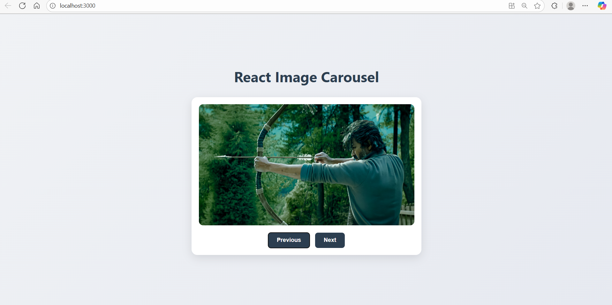
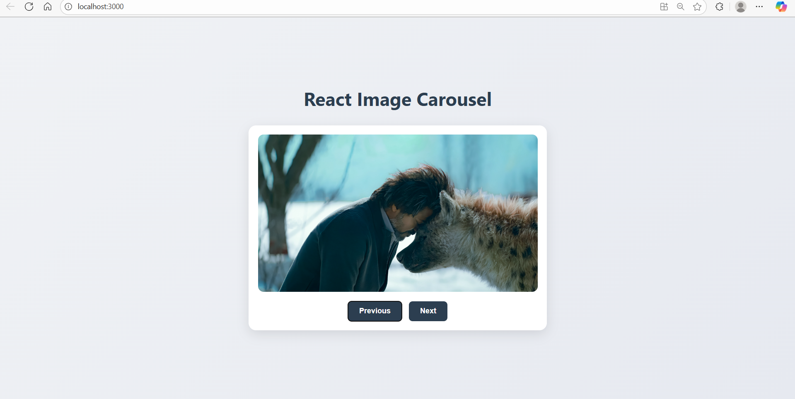

# Ex05 Image Carousel
## Date:

## AIM
To create a Image Carousel using React 

## ALGORITHM
### STEP 1 Initial Setup:
Input: A list of images to display in the carousel.

Output: A component displaying the images with navigation controls (e.g., next/previous buttons).

### Step 2 State Management:
Use a state variable (currentIndex) to track the index of the current image displayed.

The carousel starts with the first image, so initialize currentIndex to 0.

### Step 3 Navigation Controls:
Next Image: When the "Next" button is clicked, increment currentIndex.

If currentIndex is at the end of the image list (last image), loop back to the first image using modulo:
currentIndex = (currentIndex + 1) % images.length;

Previous Image: When the "Previous" button is clicked, decrement currentIndex.

If currentIndex is at the beginning (first image), loop back to the last image:
currentIndex = (currentIndex - 1 + images.length) % images.length;

### Step 4 Displaying the Image:
The currentIndex determines which image is displayed.

Using the currentIndex, display the corresponding image from the images list.

### Step 5 Auto-Rotation:
Set an interval to automatically change the image after a set amount of time (e.g., 3 seconds).

Use setInterval to call the nextImage() function at regular intervals.

Clean up the interval when the component unmounts using clearInterval to prevent memory leaks.

## PROGRAM
### App.js:
```python
import React from 'react';
import ImageCarousel from './ImageCarousel';
import './App.css';

function App() {
  // Array populated with your specific filenames
  const images = [
    '/images/Leo Desktop 01 Final.jpg',
    '/images/Leo Desktop 02 Final.jpg',
    '/images/Leo Desktop 04 FINA.jpg',
    '/images/Leo Desktop 05 FINA.jpg',
    '/images/Leo Desktop 05 Final.jpg',
    '/images/Leo Desktop 06 FINA.jpg',
    '/images/Leo Desktop 07 FINA.jpg',
    '/images/Leo Desktop 08 Final.jpg',
    '/images/Leo Desktop 11 Final.jpg',
    '/images/Leo Desktop 12 Final.jpg',
    '/images/Leo Desktop 18 Final.jpg',
    '/images/Leo Desktop 19 Final.jpg',
    '/images/Leo Desktop 20 Final.jpg',
    '/images/Leo Desktop 21 Final.jpg'
  ];

  return (
    <div className="App">
      <h1>React Image Carousel</h1>
      <ImageCarousel images={images} />
    </div>
  );
}

export default App;
```

### App.css:
```python
body {
  margin: 0;
  font-family: -apple-system, BlinkMacSystemFont, 'Segoe UI', 'Roboto', 'Oxygen',
    'Ubuntu', 'Cantarell', 'Fira Sans', 'Droid Sans', 'Helvetica Neue',
    sans-serif;
  -webkit-font-smoothing: antialiased;
  -moz-osx-font-smoothing: grayscale;
  background: linear-gradient(135deg, #f0f2f5, #e6e9f0);
  display: flex;
  justify-content: center;
  align-items: center;
  min-height: 100vh;
}

.App {
  text-align: center;
}

.App h1 {
  font-size: 2.5rem;
  color: #2c3e50;
  margin-bottom: 1rem;
}
```

### ImageCarousel.js:
```python
import React, { useState, useEffect, useCallback } from 'react';
import './ImageCarousel.css'; // Import the CSS for styling

// The component receives the 'images' array as a prop
function ImageCarousel({ images }) {
  const [currentIndex, setCurrentIndex] = useState(0);

  // Memoize the next function to prevent re-creation on every render
  const goToNext = useCallback(() => {
    setCurrentIndex((prevIndex) => (prevIndex + 1) % images.length);
  }, [images.length]);

  const goToPrevious = () => {
    setCurrentIndex((prevIndex) =>
      (prevIndex - 1 + images.length) % images.length
    );
  };

  // Set up the auto-rotation timer
  useEffect(() => {
    const timer = setInterval(() => {
      goToNext();
    }, 3000); // Change image every 3 seconds

    // Clean up the timer when the component is unmounted
    return () => clearInterval(timer);
  }, [goToNext]); // Re-run effect if goToNext changes

  return (
    <div className="carousel-container">
      <div className="carousel-image-wrapper">
        
      </div>
      <div className="carousel-buttons">
        <button onClick={goToPrevious}>Previous</button>
        <button onClick={goToNext}>Next</button>
      </div>
    </div>
  );
}

export default ImageCarousel;
```

### ImageCarousel.css:

```python
/* Carousel Container */
.carousel-container {
  max-width: 600px;
  margin: 2rem auto;
  background-color: #ffffff;
  padding: 20px;
  border-radius: 16px;
  box-shadow: 0 8px 24px rgba(0, 0, 0, 0.1);
  text-align: center;
  overflow: hidden; /* Ensures nothing spills out */
}

/* Image Wrapper for smooth transitions (optional) */
.carousel-image-wrapper {
  overflow: hidden;
  border-radius: 12px;
}

/* Image Styling */
.carousel-image {
  width: 100%;
  display: block; /* Removes bottom space under the image */
  border-radius: 12px;
  box-shadow: 0 4px 15px rgba(0, 0, 0, 0.2);
  transition: transform 0.4s ease-in-out;
}

.carousel-image:hover {
  transform: scale(1.03);
}

/* Button Container */
.carousel-buttons {
  margin-top: 20px;
  display: flex;
  justify-content: center;
  gap: 15px; /* Adds space between buttons */
}

/* Navigation Buttons */
.carousel-buttons button {
  background-color: #2c3e50;
  color: white;
  border: none;
  padding: 12px 24px;
  border-radius: 8px;
  cursor: pointer;
  font-size: 1rem;
  font-weight: bold;
  transition: background-color 0.3s ease, transform 0.2s ease;
}

.carousel-buttons button:hover {
  background-color: #34495e;
  transform: translateY(-2px); /* Slight lift on hover */
}
```

## OUTPUT





## RESULT
The program for creating Image Carousel using React is executed successfully.
